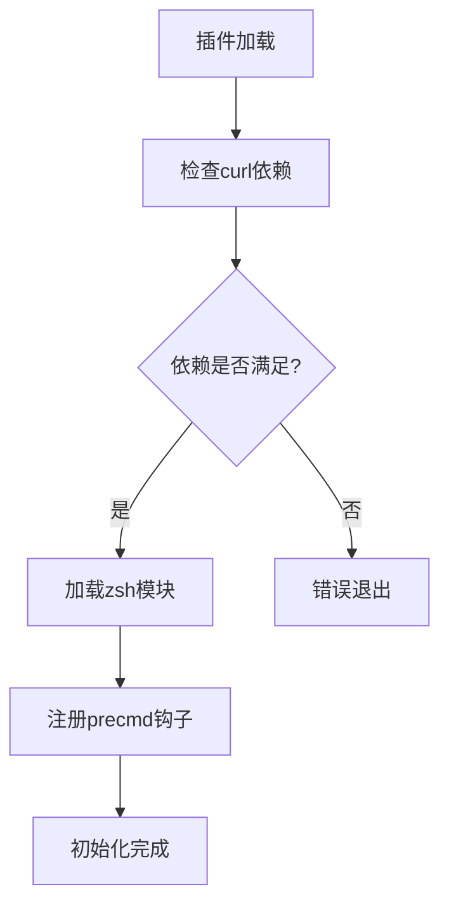
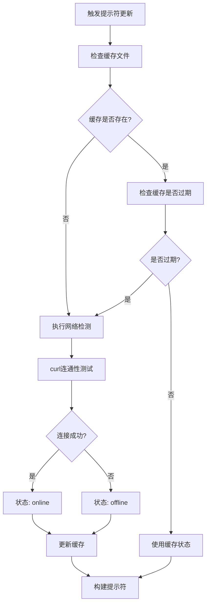
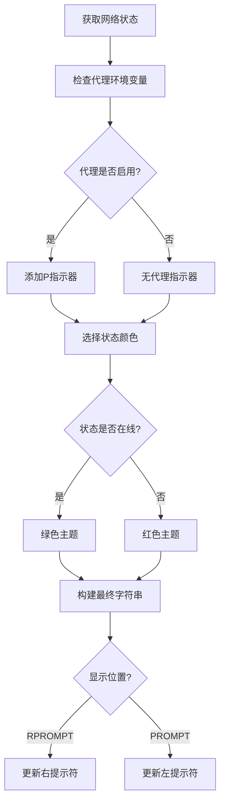

# Zsh Network Status Prompt Plugin 架构蓝图

## 📋 插件概述

这是一个高效的Zsh插件，用于在命令行提示符中实时显示网络连接状态和代理状态，具有智能缓存机制和跨平台兼容性。

## 🏗️ 架构设计

### 模块化架构图

```
┌─────────────────────────────────────────────────────────────┐
│                   Zsh Network Status Plugin                │
├─────────────────────────────────────────────────────────────┤
│  📦 配置层 (Configuration Layer)                           │
│  ├── 主机配置 (ZSH_NETWORK_STATUS_PROMPT_HOST)            │
│  ├── 超时配置 (ZSH_NETWORK_STATUS_PROMPT_TIMEOUT)         │
│  ├── 缓存配置 (ZSH_NETWORK_STATUS_PROMPT_CACHE_EXPIRATION)│
│  └── 显示配置 (ZSH_NETWORK_STATUS_PROMPT_SIDE)            │
├─────────────────────────────────────────────────────────────┤
│  💾 缓存层 (Cache Layer)                                   │
│  ├── 缓存目录管理                                          │
│  ├── 缓存文件生命周期                                      │
│  └── 跨平台stat命令适配                                    │
├─────────────────────────────────────────────────────────────┤
│  ⚙️ 核心业务层 (Core Business Layer)                      │
│  ├── 网络连通性检测                                        │
│  ├── 代理状态检测                                          │
│  ├── 状态缓存管理                                          │
│  └── 手动刷新机制                                          │
├─────────────────────────────────────────────────────────────┤
│  🎨 显示层 (Display Layer)                                 │
│  ├── 提示符构建                                            │
│  ├── 颜色主题管理                                          │
│  └── 格式化输出                                            │
├─────────────────────────────────────────────────────────────┤
│  🚀 初始化层 (Initialization Layer)                       │
│  ├── 依赖检查                                              │
│  ├── 钩子注册                                              │
│  └── 自动初始化                                            │
└─────────────────────────────────────────────────────────────┘
```

## 🔄 核心工作流程

### 1. 启动流程


### 2. 状态检测流程


### 3. 提示符更新流程


## 📚 核心函数详解

### 配置管理
| 配置项 | 默认值 | 描述 |
|--------|--------|------|
| `ZSH_NETWORK_STATUS_PROMPT_HOST` | `www.google.com` | 用于连通性测试的主机 |
| `ZSH_NETWORK_STATUS_PROMPT_TIMEOUT` | `2` | 连接超时时间(秒) |
| `ZSH_NETWORK_STATUS_PROMPT_CACHE_EXPIRATION` | `300` | 缓存过期时间(秒) |
| `ZSH_NETWORK_STATUS_PROMPT_SIDE` | `RPROMPT` | 显示位置 |

### 核心函数架构

```bash
📦 Core Functions
├── _zsh_network_status_is_proxy_enabled()
│   ├── 功能: 检测代理环境变量
│   ├── 检查项: http_proxy, https_proxy, all_proxy (大小写不敏感)
│   └── 返回: 0(启用) / 1(禁用)
│
├── _zsh_network_status_check_connectivity()
│   ├── 功能: 执行网络连通性检查
│   ├── 方法: curl HEAD请求
│   └── 特点: 静默执行，超时控制
│
├── _zsh_network_status_get_status()
│   ├── 功能: 获取网络状态(带缓存)
│   ├── 缓存策略: 时间戳检查
│   ├── 跨平台: macOS/Linux stat命令适配
│   └── 返回: "online" / "offline"
│
├── zsh_network_status_refresh()
│   ├── 功能: 强制刷新状态
│   ├── 方法: 删除缓存文件
│   └── 用途: 用户手动刷新
│
├── _zsh_network_status_build_prompt()
│   ├── 功能: 构建提示符字符串
│   ├── 元素: 状态 + 代理指示器 + 颜色
│   └── 格式: "%F{color} net:(status P)%f"
│
└── _zsh_network_status_prompt_init()
    ├── 功能: 插件初始化
    ├── 检查: curl依赖
    ├── 注册: precmd钩子
    └── 自动: 启动时执行
```

## 🎨 显示效果

### 状态显示格式
```bash
# 在线状态
🟢 net:(online)      # 无代理
🟢 net:(online P)    # 有代理

# 离线状态
🔴 net:(offline)     # 无代理
🔴 net:(offline P)   # 有代理
```

### 颜色主题
- **绿色 (`%F{green}`)**: 网络在线
- **红色 (`%F{red}`)**: 网络离线
- **重置 (`%f`)**: 恢复默认颜色

## 🛠️ 技术特性

### 1. 性能优化
- **智能缓存**: 避免频繁网络检查
- **可配置过期时间**: 平衡实时性与性能
- **异步检查**: 不阻塞命令行操作

### 2. 稳定性保证
- **依赖检查**: 启动时验证curl可用性
- **错误处理**: 网络故障时的优雅降级
- **防重复机制**: 智能更新提示符，避免重复显示

### 3. 跨平台兼容
- **macOS支持**: `stat -f %m` 获取文件时间戳
- **Linux支持**: `stat -c %Y` 获取文件时间戳
- **环境变量**: 大小写不敏感的代理检测

### 4. 用户体验
- **即时反馈**: 实时显示网络状态
- **可配置性**: 多项自定义选项
- **手动刷新**: 提供强制更新机制

## 📁 文件结构

```
zsh-network-status-prompt.plugin.zsh
├── 配置区域 (10-19行)
├── 缓存设置 (21-30行)
├── 核心函数 (32-88行)
├── 显示处理 (90-118行)
└── 初始化代码 (120-155行)
```

## 🔧 使用指南

### 安装方法
```bash
# 1. 克隆到oh-my-zsh插件目录
git clone <repo-url> ~/.oh-my-zsh/custom/plugins/zsh-network-status-prompt

# 2. 在.zshrc中添加插件
plugins=(... zsh-network-status-prompt)

# 3. 重新加载配置
source ~/.zshrc
```

### 自定义配置
```bash
# 在.zshrc中添加配置
export ZSH_NETWORK_STATUS_PROMPT_HOST="www.example.com"
export ZSH_NETWORK_STATUS_PROMPT_TIMEOUT=5
export ZSH_NETWORK_STATUS_PROMPT_CACHE_EXPIRATION=600
export ZSH_NETWORK_STATUS_PROMPT_SIDE="PROMPT"
```

### 手动刷新
```bash
# 清除缓存并强制刷新
zsh_network_status_refresh
```

## 🚀 扩展建议

1. **状态图标**: 支持emoji或自定义图标
2. **多主机检测**: 支持多个主机的故障转移
3. **网络质量**: 显示延迟或速度信息
4. **主题系统**: 支持更多颜色主题
5. **通知机制**: 网络状态变化时的桌面通知

---
*文档生成时间: 2025年7月9日*
*插件版本: 基于当前代码分析*